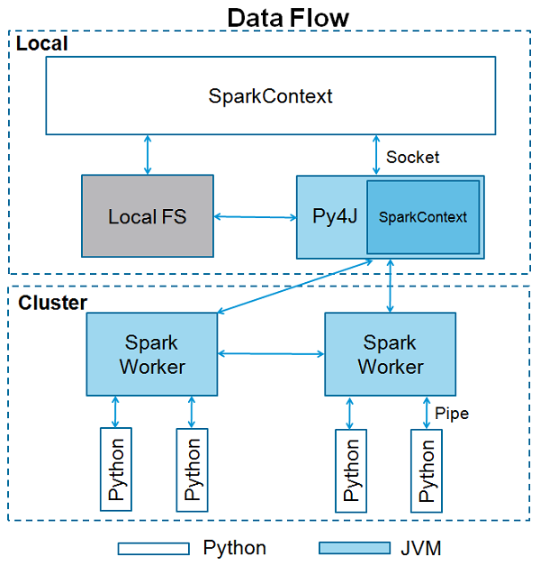

# Pyspark  
Apache Spark is written in Scala programming language. To support Python with Spark, Apache Spark Community released a tool, PySpark.  
**for installation:** At first, be sure you have installed Java and Scala and Apache Spark. Then you can easily install this library by "pip install pyspark".  

## Running ETL job  
Major file is etl_job.py. Within this file, there is a function named start_spark in which all arguments for running Spark job on pyspark such as logging, session and config are initiated. In this function, master is set to **'local[*]', the address of the Spark cluster to start the job on**. If you have a Spark cluster in operation (either in single-executor mode locally, or something larger in the cloud) and want to send the job there, then modify this with the apprioriate Spark IP - e.g. spark://the-clusters-ip-address:7077.   
Then, the main functionality of our code, ETL(Extract,Transform and Load), will be executed in Main function by calling corresponding functions till stopping the session.  
log.py is a class that wraps the **log4j object** instantiated by the active **SparkContext, enabling Log4j logging for PySpark**. By importing log.py in etl_job.py, we can make different warn, error or info messeges.  
etl_config.json - the (optional) path to any config file that may be required by the ETL job

## More Info
**SparkContext** is the entry point to any spark functionality. When we run any Spark application, a driver program starts, which has the main function and your SparkContext gets initiated here. The driver program then runs the operations inside the executors on worker nodes.  
**log4j** is a reliable, fast and flexible logging framework (APIs) written in Java, which is distributed under the Apache Software License. It has been ported to the C, C++, C#, Perl, Python, Ruby, and Eiffel languages.  

### Faced issue  
I tried different codes to write pyspark dataframe to parquete/csv file like below codes, but none of them executed. So, I changed it to Pandas dataframe and then saved.
If other than below codes works for you, I would apprecaite inform me as well.  
**tries:**  
df.coalesce(1).write.parquet('test/test_data', mode='overwrite')  
df.write.format("parquet").mode("overwrite").save('test/test_data')  
df.write.mode('overwrite').parquet("test/test_data")  
df.write.parquet("test/test_data/proto.parquet")   
df.to_parquet('test/test_data/proto.parquet')  
df.write.format('parquet').save('test_ETL.parquet')  
df.write.format('com.databricks.spark.csv').save('test/test_data/mydata.csv')
